# Plan for Creating CRUD Endpoints

This plan outlines the steps to create CRUD (Create, Read, Update, Delete) API endpoints for the models defined in `src/app/model`.

## General Approach

- Utilize Flask Blueprints, modifying the existing files in `src/app/routes` (e.g., `user_views.py`, `book_views.py`, etc.).
- Use the SQLAlchemy models (`User`, `Book`, `Author`, etc.) for database interactions via `db.session`.
- Implement request data validation (e.g., checking required fields, data types).
- Define clear JSON response structures for success and error scenarios.
- Handle relationships between models appropriately in request/response data (e.g., linking authors/categories when creating/updating a book).

## Endpoints by Model

```mermaid
graph TD
    subgraph User Management
        U1[POST /users] --> U(User);
        U2[GET /users] --> U;
        U3[GET /users/<id>] --> U;
        U4[PUT /users/<id>] --> U;
        U5[DELETE /users/<id>] --> U;
    end
    subgraph Seller Management
        S1[POST /sellers] --> S(Seller);
        S2[GET /sellers] --> S;
        S3[GET /sellers/<id>] --> S;
        S4[PUT /sellers/<id>] --> S;
        S5[DELETE /sellers/<id>] --> S;
        U -- 1-to-1 --> S;
    end
    subgraph Book Management
        B1[POST /books] --> B(Book);
        B2[GET /books] --> B;
        B3[GET /books/<id>] --> B;
        B4[PUT /books/<id>] --> B;
        B5[DELETE /books/<id>] --> B;
        B -- N-to-M --> A(Author);
        B -- N-to-M --> C(Category);
        B -- N-to-1 --> P(Publisher);
        B -- 1-to-N --> R(Rating);
        B -- N-to-1 --> S;
    end
    subgraph Author Management
        A1[POST /authors] --> A;
        A2[GET /authors] --> A;
        A3[GET /authors/<id>] --> A;
        A4[PUT /authors/<id>] --> A;
        A5[DELETE /authors/<id>] --> A;
    end
    subgraph Category Management
        C1[POST /categories] --> C;
        C2[GET /categories] --> C;
        C3[GET /categories/<id>] --> C;
        C4[PUT /categories/<id>] --> C;
        C5[DELETE /categories/<id>] --> C;
    end
    subgraph Publisher Management
        P1[POST /publishers] --> P;
        P2[GET /publishers] --> P;
        P3[GET /publishers/<id>] --> P;
        P4[PUT /publishers/<id>] --> P;
        P5[DELETE /publishers/<id>] --> P;
    end
    subgraph Rating Management
        R1[POST /ratings] --> R;
        R2[GET /ratings] --> R;
        R3[GET /ratings/<id>] --> R;
        R4[PUT /ratings/<id>] --> R;
        R5[DELETE /ratings/<id>] --> R;
        U -- 1-to-N --> R;
    end
```

### 1. User (`src/app/routes/user_views.py`)

- **Create:** `POST /users` - Create a new user.
- **Read (List):** `GET /users` - Get a list of users (consider pagination).
- **Read (Detail):** `GET /users/<int:user_id>` - Get a specific user.
- **Update:** `PUT /users/<int:user_id>` - Update a specific user.
- **Delete:** `DELETE /users/<int:user_id>` - Delete a specific user.

### 2. Seller (`src/app/routes/seller_views.py`)

- **Create:** `POST /sellers` - Create a seller profile (requires `user_id`).
- **Read (List):** `GET /sellers` - Get a list of sellers.
- **Read (Detail):** `GET /sellers/<int:seller_id>` - Get a specific seller.
- **Update:** `PUT /sellers/<int:seller_id>` - Update a specific seller.
- **Delete:** `DELETE /sellers/<int:seller_id>` - Delete a specific seller.

### 3. Book (`src/app/routes/book_views.py`)

- **Create:** `POST /books` - Create a book (link authors, categories, publisher, seller).
- **Read (List):** `GET /books` - Get a list of books (consider filtering/sorting/pagination).
- **Read (Detail):** `GET /books/<int:book_id>` - Get a specific book.
- **Update:** `PUT /books/<int:book_id>` - Update a specific book.
- **Delete:** `DELETE /books/<int:book_id>` - Delete a specific book.

### 4. Author (`src/app/routes/author_views.py`)

- **Create:** `POST /authors` - Create an author.
- **Read (List):** `GET /authors` - Get a list of authors.
- **Read (Detail):** `GET /authors/<int:author_id>` - Get a specific author.
- **Update:** `PUT /authors/<int:author_id>` - Update a specific author.
- **Delete:** `DELETE /authors/<int:author_id>` - Delete a specific author.

### 5. Category (`src/app/routes/category_views.py`)

- **Create:** `POST /categories` - Create a category.
- **Read (List):** `GET /categories` - Get a list of categories.
- **Read (Detail):** `GET /categories/<int:category_id>` - Get a specific category.
- **Update:** `PUT /categories/<int:category_id>` - Update a specific category.
- **Delete:** `DELETE /categories/<int:category_id>` - Delete a specific category.

### 6. Publisher (`src/app/routes/publisher_views.py`)

- **Create:** `POST /publishers` - Create a publisher.
- **Read (List):** `GET /publishers` - Get a list of publishers.
- **Read (Detail):** `GET /publishers/<int:publisher_id>` - Get a specific publisher.
- **Update:** `PUT /publishers/<int:publisher_id>` - Update a specific publisher.
- **Delete:** `DELETE /publishers/<int:publisher_id>` - Delete a specific publisher.

### 7. Rating (`src/app/routes/rating_views.py`)

- **Create:** `POST /ratings` - Create a rating (requires `user_id`, `book_id`).
- **Read (List):** `GET /ratings` - Get a list of ratings (consider filtering by user/book).
- **Read (Detail):** `GET /ratings/<int:rating_id>` - Get a specific rating.
- **Update:** `PUT /ratings/<int:rating_id>` - Update a specific rating.
- **Delete:** `DELETE /ratings/<int:rating_id>` - Delete a specific rating.

## Implementation Notes

- Focus on one model/route file at a time.
- Add necessary imports (`request`, `jsonify`, models, `db`).
- Use `request.get_json()` to get request data.
- Use `db.session` for database operations (`add`, `commit`, `delete`).
- Return appropriate JSON responses and HTTP status codes.

## Next Steps

1.  Implement the endpoints in the respective Python files within `src/app/routes/`.
2.  Add unit/integration tests for the new endpoints.
