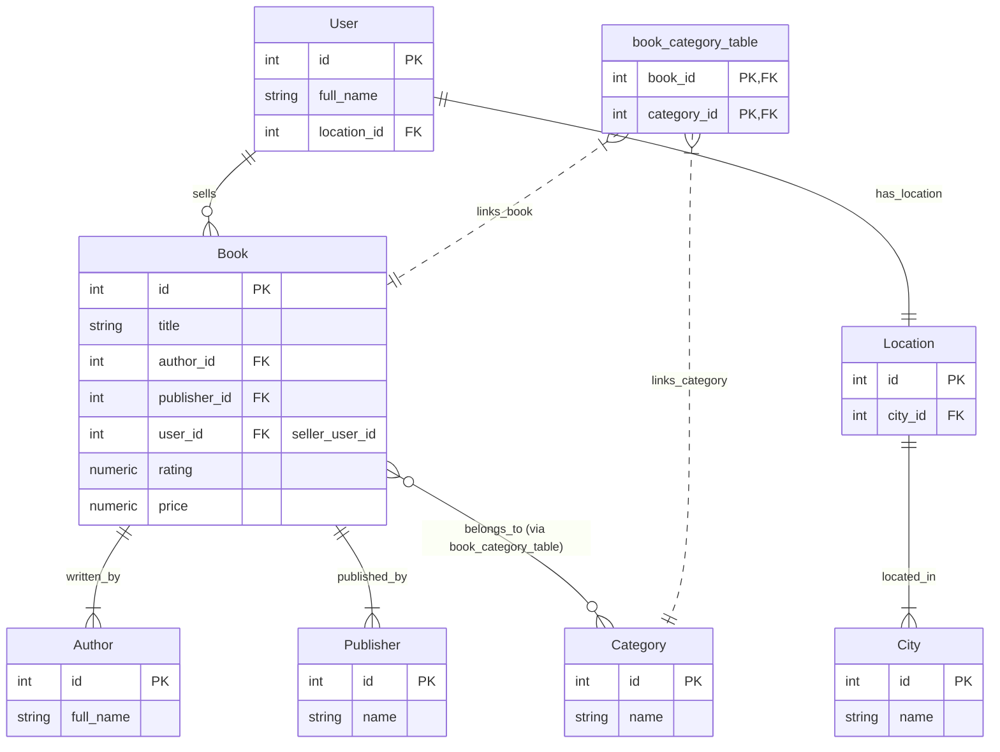

## Book Filtering Feature Plan

### 1. Goal

To allow users to filter the list of books based on:

- Multiple Categories (AND logic, by name)
- Publisher (by name)
- Author (by name)
- Seller (by user's full name)
- Seller's City (by city name)
- Minimum Rating
- Price Range (min_price to max_price)

### 2. Data Models & Relationships Overview

The filtering will primarily involve the [`Book`](src\app\model\book.py) model and its relationships with:

- [`Category`](src\app\model\category.py) (via [`book_category_table`](src\app\model\book_category_table.py))
- `Publisher` (via [`src/app/model/publisher.py`](src/app/model/publisher.py))
- `Author` (via [`src/app/model/author.py`](src/app/model/author.py))
- [`User`](src\app\model\user.py) (as the seller)
- [`Location`](src\app\model\location.py) (linked to User)
- [`City`](src\app\model\city.py) (linked to Location)

### 3. Mermaid Diagram of Relevant Models

### 4. API Endpoint Modification

The existing book listing endpoint (e.g., `GET /api/books` in [`src/app/routes/book_route.py`](src/app/routes/book_route.py)) will be updated to accept the following query parameters:

- `categories`: A comma-separated string of category names (e.g., `categories=Fiction,Mystery`).
- `publisher_name`: String, the name of the publisher.
- `author_name`: String, the name of the author.
- `seller_name`: String, the full name of the seller (user).
- `city_name`: String, the name of the city where the seller is located.
- `min_rating`: Float, the minimum average rating of the book (e.g., `min_rating=4.0`).
- `min_price`: Float, the minimum price of the book.
- `max_price`: Float, the maximum price of the book.

### 5. Service Layer Implementation (`BookService`)

The primary logic will reside in [`src/app/services/book_service.py`](src/app/services/book_service.py), likely within a method like `get_all_books_filtered()`.

**Query Construction Steps:**

1.  **Base Query**: Start with `query = Book.query`.
2.  **Categories Filter (AND logic, by Name)**:
    - If `categories` parameter is provided (e.g., "Fiction,Mystery"):
      - Parse it into a list of category names: `['Fiction', 'Mystery']`.
      - Use SQLAlchemy's `and_` and `Book.categories.any()` for each category name to ensure the book belongs to _all_ specified categories.
      - Example: `query = query.filter(and_(*[Book.categories.any(Category.name == name) for name in category_names]))`
      - This requires importing `Category` model and `and_` from `sqlalchemy`.
3.  **Publisher Filter (by Name)**:
    - If `publisher_name` is provided:
      - Join with the `Publisher` model.
      - Filter using `Publisher.name.ilike(f"%{publisher_name}%")` for case-insensitive partial matching.
      - Requires importing `Publisher` model.
4.  **Author Filter (by Name)**:
    - If `author_name` is provided:
      - Join with the `Author` model.
      - Filter using `Author.full_name.ilike(f"%{author_name}%")` for case-insensitive partial matching.
      - Requires importing `Author` model.
5.  **Seller Filter (by User Name)**:
    - If `seller_name` is provided:
      - Join with the [`User`](src\app\model\user.py) model (on `Book.user_id == User.id`).
      - Filter using `User.full_name.ilike(f"%{seller_name}%")`.
      - Requires importing `User` model.
6.  **Location Filter (by City Name)**:
    - If `city_name` is provided:
      - Perform a series of joins: `Book` -> `User` (seller) -> [`Location`](src\app\model\location.py) -> [`City`](src\app\model\city.py).
      - Filter using `City.name.ilike(f"%{city_name}%")`.
      - Requires importing `User`, `Location`, and `City` models.
7.  **Rating Filter (Minimum Rating)**:
    - If `min_rating` is provided:
      - Filter `Book.rating >= float(min_rating)`.
8.  **Price Filter (Min to Max)**:
    - If `min_price` is provided: `query = query.filter(Book.price >= float(min_price))`.
    - If `max_price` is provided: `query = query.filter(Book.price <= float(max_price))`.

### 6. Implementation Steps

1.  **Modify [`src/app/routes/book_route.py`](src/app/routes/book_route.py):**
    - Update the relevant route function (e.g., `get_books`) to retrieve all new filter parameters from `request.args`.
    - Pass these parameters to the updated service method in [`src/app/services/book_service.py`](src/app/services/book_service.py).
2.  **Modify [`src/app/services/book_service.py`](src/app/services/book_service.py):**
    - Create or update a method (e.g., `get_all_books_filtered`) to accept all new filter parameters.
    - Implement the dynamic query construction logic as described in "Query Construction Steps" above.
    - Ensure all necessary models (`Book`, `Category`, `Publisher`, `Author`, `User`, `Location`, `City`) and SQLAlchemy utilities (`and_`, `func`) are imported.
3.  **Testing:**
    - Write unit/integration tests for the service layer to cover various filtering combinations.
    - Perform manual API testing using tools like Postman or `curl` to verify:
      - No filters applied (returns all books).
      - Each filter individually.
      - Combinations of multiple filters, especially the "AND" logic for categories.
      - Edge cases (e.g., non-existent names, empty filter values, invalid price/rating formats).
