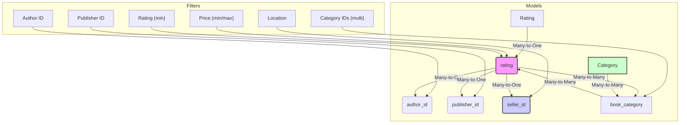

# Plan: Enhance Book Filtering Feature

**1. Goal:**

To enhance the `GET /api/v1/books/` endpoint to allow users to filter the list of books based on:

- Price range (min/max)
- Multiple categories simultaneously
- Seller location
- Publisher ID
- Author ID
- Minimum rating

**2. Current State Analysis:**

The existing `list_books` function in `src/app/routes/book_views.py` already supports filtering by:

- `author_id` (Exact match)
- `publisher_id` (Exact match)
- `seller_id` (Exact match)
- `category_id` (Exact match, **single category only**)
- `min_price`, `max_price` (Range)
- `min_rating` (Range, based on `Book.rating` field)
- `search` (Term matching against title/description)

It also includes pagination and sorting.

**3. Proposed Enhancements & Implementation Steps:**

We need to modify the `list_books` function to accommodate the new requirements, primarily for multi-category selection and location filtering.

**3.1. Multi-Category Filtering:**

- **API Change:** Modify the endpoint to accept multiple `category_id` parameters instead of a single one.
  - Example Request: `GET /api/v1/books/?category_id=1&category_id=5&category_id=12`
- **Implementation:**
  - In `list_books`, use `request.args.getlist('category_id', type=int)` to retrieve a list of category IDs.
  - If category IDs are provided, modify the SQLAlchemy query to filter books associated with _any_ of the specified categories.
  ```python
  # Inside list_books function in book_views.py
  category_ids = request.args.getlist('category_id', type=int)
  if category_ids:
      # Replace the existing single category filter logic
      query = query.filter(Book.categories.any(Category.id.in_(category_ids)))
  ```

**3.2. Location Filtering:**

- **API Change:** Add a new query parameter `location`.
  - Example Request: `GET /api/v1/books/?location=Jakarta`
- **Implementation:**
  - In `list_books`, retrieve the `location` parameter from `request.args`.
  - If the `location` parameter is present, join the `Book` query with the `Seller` model and filter by the `location` field. Using a case-insensitive partial match (`ilike`) is recommended for better usability.
  ```python
  # Inside list_books function in book_views.py
  location = request.args.get('location', type=str)
  if location:
      # Ensure Seller model is imported: from ..model.seller import Seller
      # Add a join to the Seller table
      query = query.join(Book.seller) # Or query.join(Seller, Book.seller_id == Seller.id)
      # Apply the filter (case-insensitive partial match)
      search_location = f"%{location}%"
      query = query.filter(Seller.location.ilike(search_location))
  ```
  - **Model Relationship:** The `Book` model already has a `seller = db.relationship('Seller', back_populates='books')` relationship, and `Seller` has a `location` field.

**3.3. Review Existing Filters (Confirmation):**

- **Price Range (`min_price`, `max_price`):** Already implemented correctly using `Book.price`. No changes needed.
- **Publisher (`publisher_id`):** Already implemented correctly using `Book.publisher_id`. No changes needed.
- **Author (`author_id`):** Already implemented correctly using `Book.author_id`. No changes needed.
- **Rating (`min_rating`):** Already implemented correctly using `Book.rating`. No changes needed.

**4. API Parameter Summary (Updated):**

- `page`: integer (Default: 1)
- `per_page`: integer (Default: 10, Max: 100)
- `min_price`: decimal
- `max_price`: decimal
- `category_id`: integer (Can be specified multiple times, e.g., `category_id=1&category_id=5`)
- `location`: string (Partial match, case-insensitive)
- `publisher_id`: integer
- `author_id`: integer
- `min_rating`: decimal
- `search`: string (Searches title and description)
- `sort_by`: string (e.g., `price`, `rating`, `created_at`. Default: `created_at`)
- `sort_order`: string (`asc` or `desc`. Default: `desc`)

**5. Database Query Considerations:**

- **Joins:** The location filter requires a `JOIN` between the `book` and `seller` tables. Ensure this join is added only when the `location` filter is active.
- **Indexing:** For performance, especially with a large number of sellers, consider adding a database index to the `seller.location` column.
  ```sql
  -- Example PostgreSQL index (syntax might vary for other DBs)
  CREATE INDEX IF NOT EXISTS ix_seller_location ON seller (location);
  -- Or potentially a trigram index for faster ILIKE performance
  CREATE EXTENSION IF NOT EXISTS pg_trgm;
  CREATE INDEX IF NOT EXISTS ix_seller_location_trgm ON seller USING gin (location gin_trgm_ops);
  ```
- **Eager Loading:** Continue using `selectinload` and `joinedload` appropriately in the base query to prevent N+1 problems when serializing the results. The existing eager loads seem reasonable.

**6. Testing Strategy:**

- Add/update unit or integration tests for the `list_books` endpoint.
- Test cases should cover:
  - Filtering by multiple categories.
  - Filtering by location (partial and case-insensitive matches).
  - Combinations of new and existing filters.
  - Edge cases (e.g., non-existent IDs, invalid parameter types, empty results).
  - Pagination and sorting applied alongside filters.

**7. Mermaid Diagram (Model Relationships for Filtering):**


