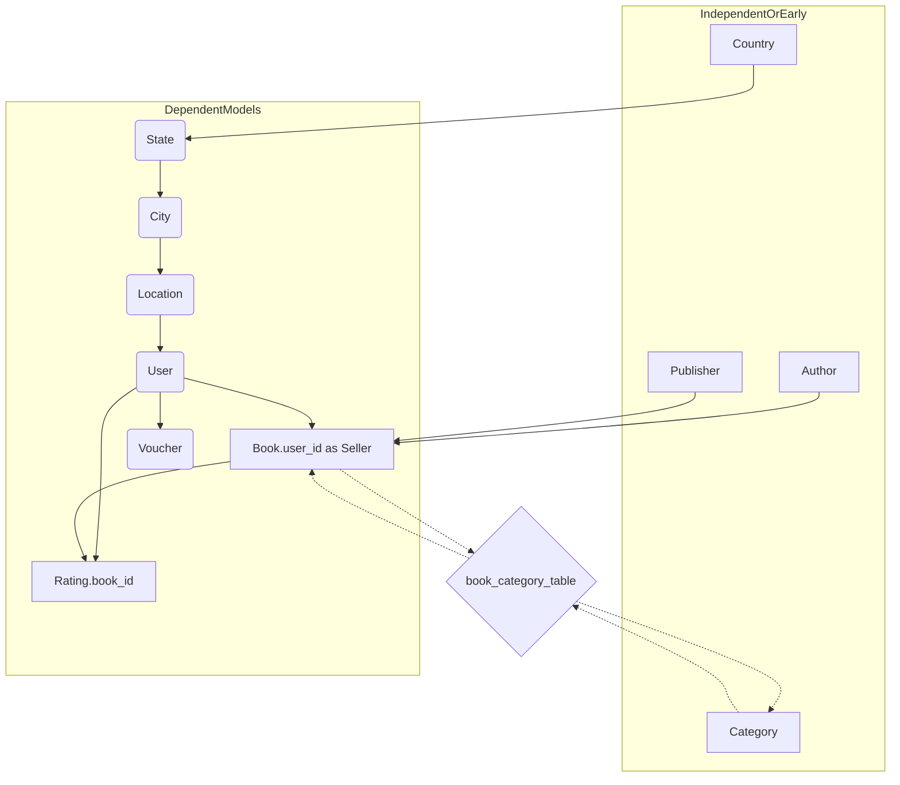

# Plan for Creating a Database Seeder with Faker

This plan outlines the steps to create a database seeder using the Faker library for a Flask-SQLAlchemy application. The goal is to populate the database with realistic sample data for development and testing.

**I. Prerequisites and Setup**

1.  **Install Faker:**
    - Add `Faker` to your project's dependencies.
      - If using Poetry, add to `pyproject.toml` under `[tool.poetry.dependencies]` and run `poetry install`.
      - Alternatively, add to `pyproject.toml` under `[project.dependencies]` and run `uv pip install -e .`.
      - Or directly install using `uv pip install Faker`.
2.  **Locate/Prepare Seeder File:**
    - The primary seeder script will be [`src/app/seed.py`](src/app/seed.py).
3.  **Imports in [`src/app/seed.py`](src/app/seed.py):**
    - `from faker import Faker`
    - Import your Flask `app` instance and `db` object (e.g., `from src.app import app, db` or from `src.app.extensions import db` and `from src.app.config import app`).
    - Import all relevant models:
      ```python
      from src.app.model.author import Author
      from src.app.model.blacklist_token import BlacklistToken
      # from src.app.model.book_category_table import book_category_table # Association table, not directly seeded as objects
      from src.app.model.book import Book
      from src.app.model.category import Category
      from src.app.model.city import City
      from src.app.model.country import Country
      from src.app.model.location import Location
      from src.app.model.publisher import Publisher
      from src.app.model.rating import Rating
      from src.app.model.state import State
      from src.app.model.user import User
      from src.app.model.voucher import Voucher, VoucherType
      from src.app.utils.security import hash_password, generate_referral_code
      ```
    - `import random`
    - `from datetime import datetime, timedelta`
    - `from decimal import Decimal`
4.  **Initialize Faker:**
    - `fake = Faker()`
    - For Indonesian-specific data: `fake_id = Faker(['id_ID'])` (use as needed).
5.  **Helper Function to Clear Data (Optional but Recommended):**
    - Create a function `clear_data()` in [`src/app/seed.py`](src/app/seed.py) to delete data from tables in reverse order of dependency.
    ```python
    def clear_data():
        with app.app_context():
            db.session.execute(text("SET FOREIGN_KEY_CHECKS = 0;")) # For MySQL if needed
            # Order matters due to foreign key constraints
            BlacklistToken.query.delete()
            Rating.query.delete()
            Voucher.query.delete()
            # book_category_table is handled by Book/Category relationships
            # If you have direct operations on it, clear here.
            # db.session.execute(book_category_table.delete())
            Book.query.delete() # Deleting books will also affect book_category_table entries via cascade if set
            Category.query.delete()
            Author.query.delete()
            Publisher.query.delete()
            User.query.delete()
            Location.query.delete()
            City.query.delete()
            State.query.delete()
            Country.query.delete()
            db.session.commit()
            # db.session.execute(text("SET FOREIGN_KEY_CHECKS = 1;")) # For MySQL
    ```

**II. Seeding Logic - Order of Operations is Crucial**

Define functions for seeding each model. Each function should accept a `count` parameter.

1.  **`seed_countries(count=5)`**

    - Fields: `name` (`fake.unique.country()`), `code` (`fake.unique.country_code()`).
    - Return list of created country objects.

2.  **`seed_states(countries, states_per_country=3)`**

    - Iterate through `countries`. For each, create `states_per_country` states.
    - Fields: `name` (`fake.state()`), `country_id` (from parent country).
    - Return list of created state objects.

3.  **`seed_cities(states, cities_per_state=4)`**

    - Iterate through `states`. For each, create `cities_per_state` cities.
    - Fields: `name` (`fake.city()`), `state_id` (from parent state).
    - Return list of created city objects.

4.  **`seed_locations(cities, count=20)`**

    - Fields: `name` (`fake.street_name()`), `address` (`fake.address()`), `zip_code` (`fake.zipcode()`), `city_id` (randomly from `cities`).
    - Return list of created location objects.

5.  **`seed_users(locations, count=30)`**

    - Fields:
      - `full_name`: `fake.name()`
      - `email`: `fake.unique.email()`
      - `password_hash`: `hash_password("password123")`
      - `role`: `random.choice(['customer', 'admin', 'seller'])`
      - `balance`: `fake.pydecimal(left_digits=5, right_digits=2, positive=True, min_value=0, max_value=100000)`
      - `referral_code`: `generate_referral_code()` (ensure it's unique or handle collisions)
      - `location_id`: `random.choice([loc.id for loc in locations] + [None])` (allow some users without locations)
      - `is_active`: `True`
    - Return list of created user objects.

6.  **`seed_authors(count=15)`**

    - Fields: `full_name` (`fake.name()`), `bio` (`fake.text(max_nb_chars=300)`).
    - Return list of created author objects.

7.  **`seed_publishers(count=10)`**

    - Fields: `name` (`fake.unique.company()`).
    - Return list of created publisher objects.

8.  **`seed_categories(count=10)`**

    - Predefined list or Faker: `name` (`fake.unique.word().capitalize()` or `random.sample(['Fiction', 'Science', 'History', 'Tech', 'Fantasy', 'Bio', 'Mystery', 'Thriller', 'Romance', 'Kids'], count)`).
    - Return list of created category objects.

9.  **`seed_books(authors, publishers, users, categories, count=100)`**

    - Fields:
      - `title`: `fake.catch_phrase()`
      - `author_id`: `random.choice([a.id for a in authors])`
      - `publisher_id`: `random.choice([p.id for p in publishers])`
      - `user_id`: `random.choice([u.id for u in users if u.role == 'seller' or u.role == 'admin'])` (books sold by sellers/admins)
      - `description`: `fake.paragraph(nb_sentences=3)`
      - `rating`: `Decimal(str(fake.random_int(min=1, max=5)) + '.' + str(fake.random_int(min=0, max=99))).quantize(Decimal('0.01'))` or `None`.
      - `quantity`: `fake.random_int(min=0, max=50)`
      - `price`: `fake.pydecimal(left_digits=3, right_digits=2, positive=True, min_value=Decimal('5.00'), max_value=Decimal('200.00'))`
      - `discount_percent`: `fake.random_int(min=0, max=50)`
      - `image_url_1`, `image_url_2`, `image_url_3`: `fake.image_url()` or placeholder.
    - **Many-to-Many for Categories:** For each book, `book.categories.extend(random.sample(categories, k=random.randint(1, 3)))`.
    - Return list of created book objects.

10. **`seed_ratings(users, books, count=200)`**

    - Fields:
      - `user_id`: `random.choice([u.id for u in users])`
      - `book_id`: `random.choice([b.id for b in books])`
      - `score`: `fake.random_int(min=1, max=5)`
      - `text`: `fake.sentence()` if `random.random() > 0.3` else `None`.
    - (Consider adding logic to prevent duplicate user/book ratings if necessary for testing).

11. **`seed_vouchers(users, count=20)`**

    - Fields:
      - `code`: `Voucher._generate_voucher_code()` (call the class method)
      - `name`: `fake.bs().title() + ' Offer'`
      - `description`: `fake.sentence(nb_words=6)`
      - `type`: `random.choice([VoucherType.PERCENTAGE, VoucherType.FIXED_AMOUNT, VoucherType.WELCOME])`
      - `value`: If percentage, `Decimal(fake.random_int(min=5, max=30))`. If fixed, `fake.pydecimal(left_digits=2, right_digits=2, positive=True, min_value=Decimal('5.00'), max_value=Decimal('50.00'))`.
      - `min_transaction`: `fake.pydecimal(left_digits=3, right_digits=2, positive=True, min_value=Decimal('10.00'), max_value=Decimal('100.00'))`
      - `max_discount`: If percentage, `fake.pydecimal(left_digits=2, right_digits=2, positive=True, min_value=Decimal('10.00'), max_value=Decimal('30.00'))` or `None`.
      - `expired_date`: `datetime.utcnow() + timedelta(days=fake.random_int(min=30, max=120))`
      - `usage_limit`: `fake.random_int(min=1, max=100)` (some single-use, some multi-use)
      - `user_id`: `random.choice([u.id for u in users] + [None] * 5)` (some user-specific, many general)

12. **`seed_blacklist_tokens(count=5)` (Optional)**
    - Fields: `token` (`fake.sha256()`), `blacklisted_on` (`fake.past_datetime()`).

**III. Main Seeding Orchestration Function in [`src/app/seed.py`](src/app/seed.py)**

```python
# In src/app/seed.py

def seed_all():
    with app.app_context():
        # clear_data() # Uncomment to clear data before seeding
        # print("Cleared existing data.")

        print("Seeding countries...")
        countries = seed_countries(count=5) # Reduced for brevity
        db.session.commit()

        print("Seeding states...")
        states = seed_states(countries, states_per_country=2)
        db.session.commit()

        print("Seeding cities...")
        cities = seed_cities(states, cities_per_state=2)
        db.session.commit()

        print("Seeding locations...")
        locations = seed_locations(cities, count=30)
        db.session.commit()

        print("Seeding users...")
        users = seed_users(locations, count=20)
        db.session.commit()

        print("Seeding authors...")
        authors = seed_authors(count=10)
        db.session.commit()

        print("Seeding publishers...")
        publishers = seed_publishers(count=5)
        db.session.commit()

        print("Seeding categories...")
        categories = seed_categories(count=8)
        db.session.commit()

        print("Seeding books and book_categories...")
        books = seed_books(authors, publishers, users, categories, count=50)
        db.session.commit()

        print("Seeding ratings...")
        seed_ratings(users, books, count=100)
        db.session.commit()

        print("Seeding vouchers...")
        seed_vouchers(users, count=15)
        db.session.commit()

        # print("Seeding blacklist tokens...")
        # seed_blacklist_tokens(count=3)
        # db.session.commit()

        print("Database seeding complete!")

if __name__ == '__main__':
    # This allows running the seeder directly: python -m src.app.seed
    # Ensure your app and db are initialized correctly if run this way.
    # It's often better to use a Flask CLI command.
    from src.app import create_app # Or however your app is created
    app = create_app()
    seed_all()
```

**IV. Running the Seeder**

- **Flask CLI Command (Recommended):**
  In [`src/run.py`](src/run.py) (or your main app file):

  ```python
  from src.app import seed # Or from .app import seed if run.py is outside src

  # ... (your existing app setup)

  @app.cli.command("seed-db")
  def seed_db_command():
      """Seeds the database with sample data."""
      seed.seed_all()
  ```

  Run with: `flask seed-db`

- **Direct Execution:**
  `python -m src.app.seed`
  (Ensure `PYTHONPATH` is set up correctly or that your app initialization within `if __name__ == '__main__':` in `seed.py` works standalone.)

**Mermaid Diagram of Model Relationships (Simplified for Seeding Order):**



This plan provides a structured approach to creating your database seeder. Remember to commit `db.session.commit()` after each logical group of data is added, or at least periodically, to manage transaction size and get feedback sooner if issues arise.
